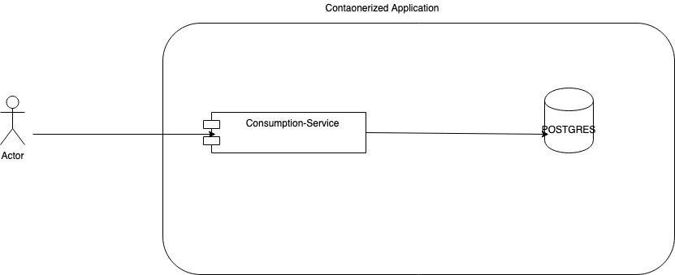
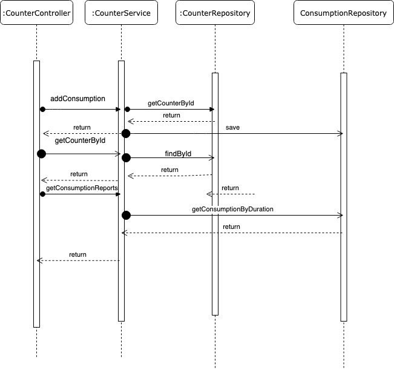
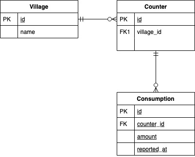
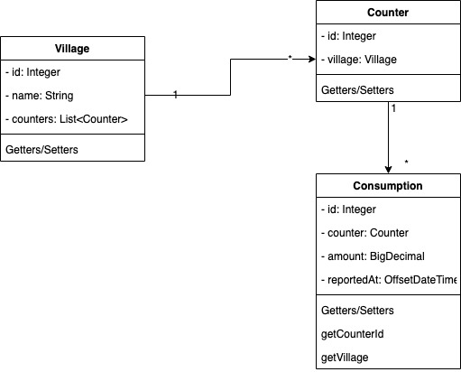

# Zenhome Task 2

## Assumption
- count of last 24h reading is accumulation of reading of particular counter in last 24h
## Overview

- This is an containerized application . The container contains spring boot REST application
  and POSTGRESS Database.
  
  
  
## Sequence Diagram overview

- The application is a 3-layer architecture with controller,service and repository layer
- A Typical interaction in the application looks like below




## ER-Diagram



## Class Diagram



## Building Instruction

- Java 11+
- Docker
- Run ```mvn clean package spring-boot:repackage```
- Run ```docker-compose build```
- RUN ```docker-compose up```

## API SPEC

```text
POST /counter_callback
Header Content-type: "application/json"
Request Body 

{
      "counter_id":3,
      "amount":124.00
 }

Response Body

{
      "counter_id":3,
      "amount":124.00
 }
```

```text
GET /counters/{id}
Response Body

 {
      "counter_id":1,
      "amount":123.00
 }
```

```text
GET /consumption_reports?duration=24h

Response Body

{
    "villages": [
        {
            "consumption": "123.0",
            "village_name": "Villarriba"
        },
        {
            "consumption": "247.0",
            "village_name": "Villabajo"
        }
    ]
}
```


